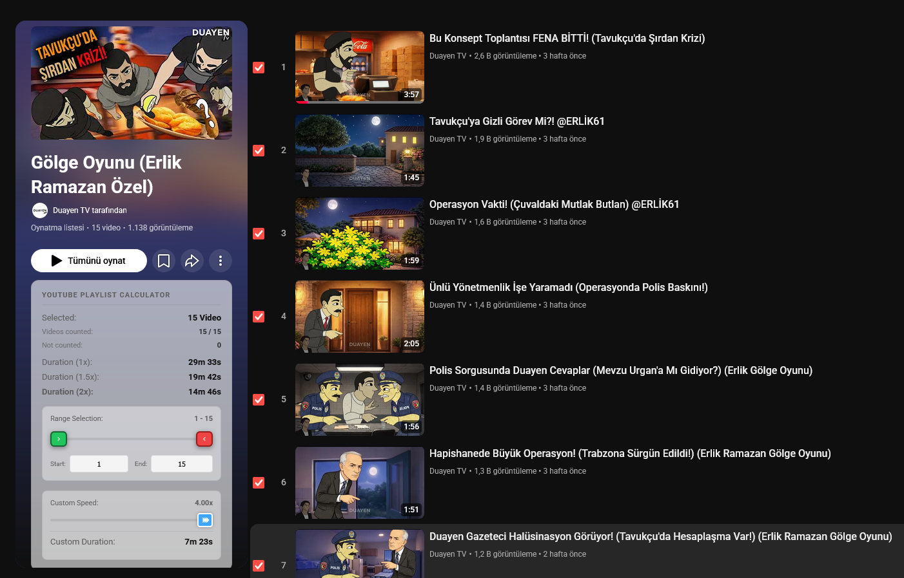
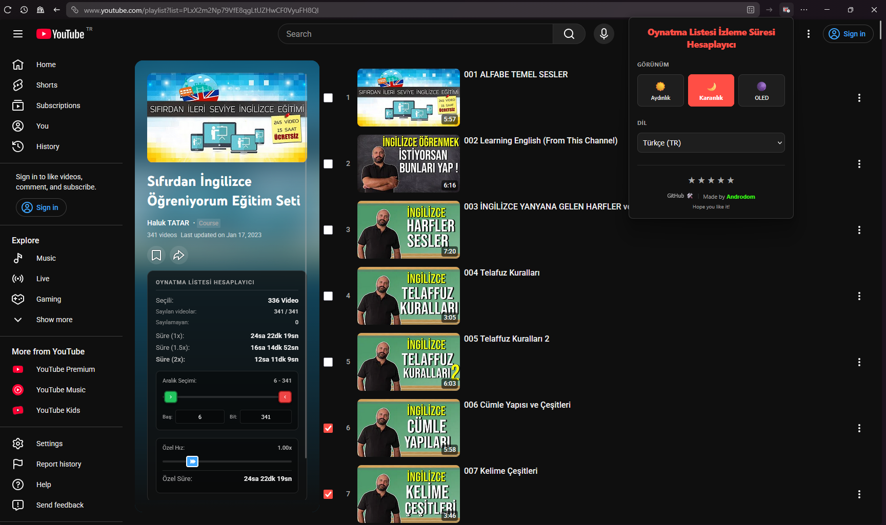
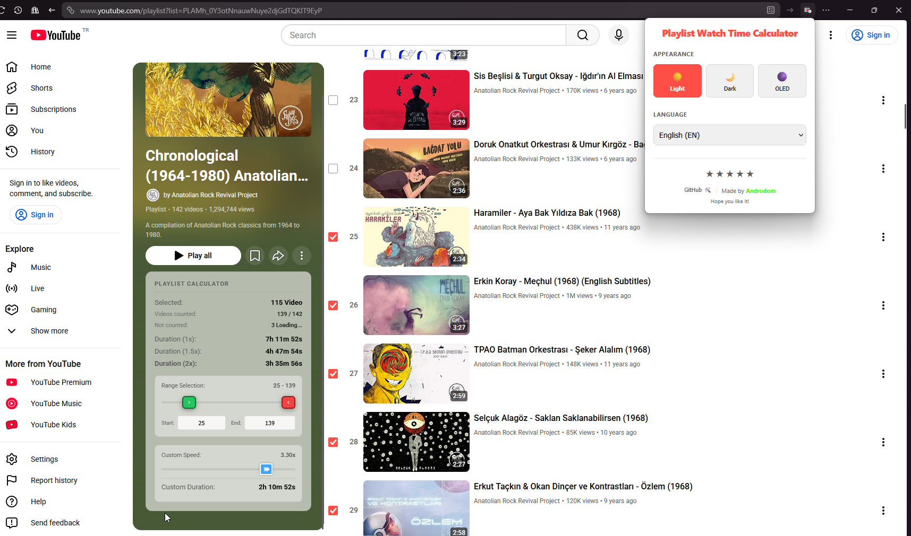
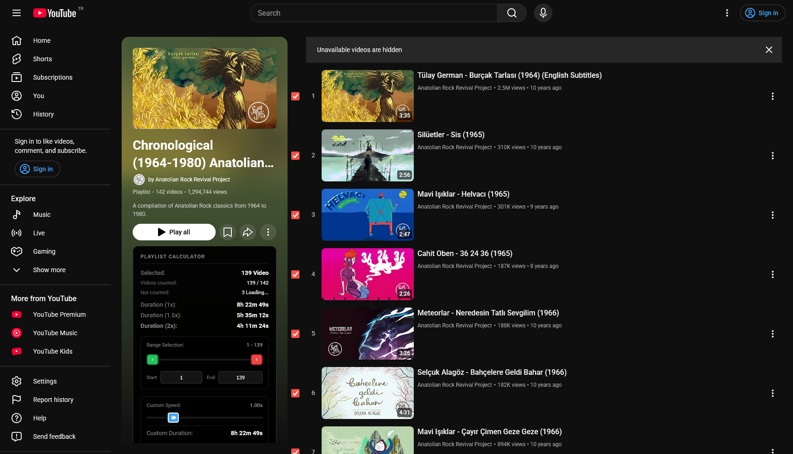
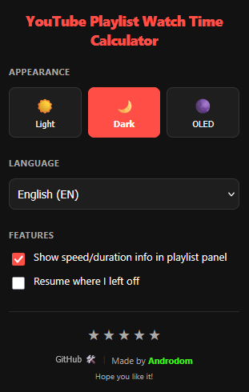
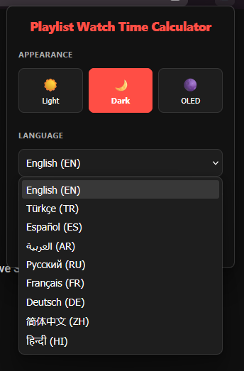

  

  # 🕒 YouTube Playlist Length & Time Calculator

  

    <strong>✨ A powerful, non-intrusive extension to calculate exact YouTube playlist lengths at custom speeds. Save your watch time, track your progress, and optimize your learning!</strong>
  

  

    
    
  

  

    
    
    
    
    
  

  

    
    
    
    
    
  

  

    
    
    
  

---

## 📖 Table of Contents
- [About the Project](#-about-the-project)
- [Key Features](#-key-features)
- [Previews](#-previews)
- [Installation](#-installation)
- [Usage Guide](#-usage-guide)
- [Supported Languages](#-supported-languages)
- [Permissions Explained](#-permissions-explained)
- [Contributing](#-contributing)
- [License & Privacy](#-license--privacy)

---

## 🚀 About the Project

Have you ever looked at a YouTube playlist with 150 videos and wondered precisely how long it would take to finish? **YouTube Playlist Length & Time Calculator** effortlessly answers this by overlaying an elegant, non-intrusive panel directly onto the YouTube interface. 

It automatically sums up all video durations—even as you scroll and load more videos via pagination—and provides instantly calculated custom playback speeds (1.25x, 1.5x, 2x, etc.) so you can plan your time effectively. Whether you are binge-watching a tutorial series or auditing an online course, this tool puts you in complete control of your time.

---

## 🌟 Why Choose This Extension?
- 🚫 **Zero Tracking & No Ads:** Proudly built with a privacy-first mindset. No telemetry, no data collection.
- 🎨 **Native Feel:** Designed to look and feel like an official YouTube feature with pixel-perfect UI.
- ⚡ **Lightweight & Fast:** Highly optimized vanilla JavaScript that doesn't slow down your browser.

---

## ✨ Key Features

- **⚡ Instant & Live Calculation:** Detects video timestamps on the fly. As YouTube loads more videos via infinite scroll, the watch time updates instantly.
- **🎯 Precise Range Selection:** Don't care about the first 10 videos? Input a custom `Start` and `End` index to calculate watch time for a specific chunk of the playlist.
- **🔄 Smart Resume Sync:** Enable "Auto-sync Start to last watched" so the calculator instantly aligns its starting point to your red YouTube progress bars!
- **🚀 Playback Speed Modifiers:** See exactly how much time you save by watching at 1.25×, 1.5×, 1.75×, 2.0×, or your own custom speed factor.
- **⏱️ Live Remaining Time:** Not just for playlists! Calculates the exact remaining time of the currently playing video, dynamically adjusted to your active playback speed.
- **🎨 Premium Theming:** A beautifully crafted popup UI with 3 built-in themes:
  - ☀️ **Light:** Clean, vibrant, and contrast-rich.
  - 🌙 **Dark:** Easy on the eyes for night sessions.
  - ⬛ **OLED:** True dark black to save power & reduce glare.
- **🌍 Massive Localization:** Fully translated into **16 major languages** with real-time UI switching (no page refresh required).
- **🔒 Privacy First Architecture:** Runs 100% locally. Zero telemetry, zero analytics, zero data transmission.

---

## 📸 Previews

  
<strong>Actual Extension Running on YouTube:</strong>

  
  
  
    
  
<strong>Advanced UI & Functionality:</strong>

  
  
  
    
  
<strong>Premium Settings Panel:</strong>

  
  

---

## 🛠️ Installation

### 📥 Install from Official Stores
- **[Firefox Add-ons Page](https://addons.mozilla.org/en-US/firefox/addon/watchtime-calc/)**
- 🟡 **Chrome Web Store** — *Coming soon!* In the meantime, follow the manual installation steps below.

### 💻 Manual Installation (Developer Mode)

#### 🟡 Google Chrome (and Chromium-based browsers)

> This also works for **Microsoft Edge**, **Brave**, **Opera**, **Vivaldi**, and other Chromium-based browsers.

1. **Download** the source code: click the green **"Code"** button on this GitHub page → **"Download ZIP"**, then extract the ZIP to a folder.
2. Open Chrome and go to `chrome://extensions`.
3. Enable **"Developer mode"** using the toggle in the **top-right corner**.
4. Click **"Load unpacked"**.
5. Browse to and select the **extracted project folder** (the one containing `manifest.json`).
6. The extension will appear in your toolbar — pin it by clicking the 🧩 puzzle icon and then the 📌 pin next to the extension name.

> ⚠️ **Note:** Manually loaded extensions are not auto-updated. To update, re-download the latest source and repeat from step 4.

#### 🦊 Mozilla Firefox
1. Open Firefox and navigate to `about:debugging`.
2. Click **"This Firefox"** in the left sidebar.
3. Click **"Load Temporary Add-on…"**.
4. Select the `manifest.json` file from the extracted project folder.

> ⚠️ **Note:** Temporary add-ons are removed when Firefox is closed. For a permanent install, use the [Firefox Add-ons Page](https://addons.mozilla.org/en-US/firefox/addon/watchtime-calc/).

---

## 🕹️ Usage Guide

Getting started is completely seamless:

1. 🔍 **Navigate to a Playlist:** Open any YouTube Playlist page (`youtube.com/playlist?list=...`) or watch a video within a playlist (`youtube.com/watch?v=...&list=...`).
2. 🧮 **Automatic Injection:** The beautifully crafted calculator panel will automatically appear on the screen.
3. ⚙️ **Customize Your Experience:** Click the gear icon on the panel (or the extension icon in your browser toolbar) to change themes, switch languages, or toggle advanced features like `Smart Resume Sync`.
4. 🖱️ **Scroll & Load:** Scroll down the YouTube page to load more videos into the list; the extension automatically captures new chunks and updates the total calculation live!

---

## 🌍 Supported Languages

The extension features a totally dynamic local localization engine. Adding a new language is as simple as dropping a `<lang_code>/strings.json` file into the `ek/lang/` directory.

Currently supported out-of-the-box:

| Arabic `(ar)` | Azerbaijani `(az)` | Chinese `(zh)` | English `(en)` |
| :---: | :---: | :---: | :---: |
| **French** `(fr)` | **German** `(de)` | **Hindi** `(hi)` | **Indonesian** `(id)` |
| **Italian** `(it)` | **Japanese** `(ja)` | **Kazakh** `(kk)` | **Korean** `(ko)` |
| **Portuguese** `(pt)` | **Russian** `(ru)` | **Spanish** `(es)` | **Turkish** `(tr)` |

---

## 🛡️ Permissions Explained

For complete transparency regarding browser extension permissions:

| Permission Requirement | Technical Justification |
|-----------------------|-------------------------|
| `storage` | Required to save your localized preferences (Theme & Language) locally across browser sessions. |
| `*://*.youtube.com/*` | Required to securely inject the content script and read the public DOM elements (video duration timestamps) on YouTube. |

*Read our full [Privacy Policy](PRIVACY_POLICY.md) for deeper details on how we protect you.*

---

## 🤝 Contributing

Contributions are what make the open-source community such an amazing place to learn, inspire, and create. Any contributions you make are **greatly appreciated**.

1. Fork the Project
2. Create your Feature Branch (`git checkout -b feature/AmazingFeature`)
3. Commit your Changes (`git commit -m 'Add some AmazingFeature'`)
4. Push to the Branch (`git push origin feature/AmazingFeature`)
5. Open a Pull Request

---

## ⚖️ License & Privacy

Distributed under the **Apache License 2.0**. See `LICENSE` for more information.

Our commitment to privacy is uncompromising. See `PRIVACY_POLICY.md` to review our stance on absolute data minimization and security.

   
  <i>Crafted with passion by <a href="https://www.androdom.com.tr">Androdom</a></i>

